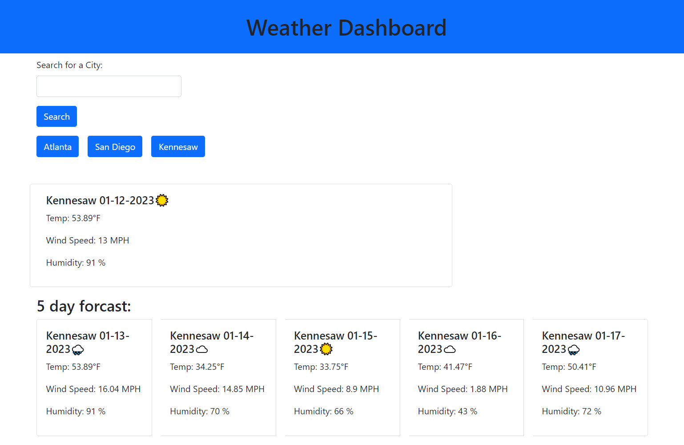

# Weather Dashboard

## Description

This project is designed to help people keep track of the weather in different cities in the world. The program will save all your previously searched cities, and you can view them by clicked on the button with the corresponding city name.

## Installation

N/A

## Usage

Enter a city into the search bar, then click the search buton and the current weather and the 5 day forecast will display for that city. You can view cities you have already searched by clicking on the button of that city.

https://harljos.github.io/weather-dashboard/
## Credits

N/A

## License

N/A